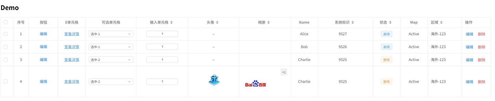

# SmartTable 使用文档

## 概览

`SmartTable` 是一个 **基于 Vue 3 + Element Plus** 的高可复用表格组件，面向 **中后台系统** 场景设计，强调：

- 配置驱动（columns 即 schema）
- 权限解耦（不依赖 store / 登录体系）
- 操作列智能显示（无可见按钮 → 整列隐藏）
- 列显隐持久化（方案 A：只缓存 visible）
- 单元格渲染器体系（renderer 插件化）

---

## 目录结构

```txt
SmartTable/
├─ column/
│  ├─ index.vue            # TableColumn 子组件
│  └─ renderer.ts          # renderer 注册中心
├─ hooks/
│  ├─ useOperationColumn.ts # 操作列按钮可见性 / 宽度逻辑
│  └─ useTableColumns.ts    # 列显隐缓存（只缓存 visible）
├─ index.vue               # SmartTable 主组件
├─ types.ts                # ColumnConfig / ButtonConfig 类型
└─ README.md
```

---

## 1. SmartTable Props

| 属性 | 类型 | 默认值 | 说明 |
| --- | --- | --- | --- |
| data | `any[]` | `[]` | 表格数据 |
| columns | `ColumnConfig[]` | `[]` | 列配置（支持 v-model:columns） |
| rowKey | `string` | `'id'` | 行唯一 key |
| loading | `boolean` | `false` | loading 状态 |
| permissions | `string[]` | `[]` | 当前用户权限列表 |
| pageKey | `string` | - | 列缓存 pageKey（可选） |
| userId | `string \| number` | - | 列缓存 userId（可选） |

> 其余属性将 **透传给 el-table**。

---

## 2. ColumnConfig 列配置

```ts
export interface ColumnConfig<R = any> {
  type?: 'selection' | 'index' | 'operation'
  key?: string
  label?: string

  visible?: boolean
  inControl?: boolean
  render?: string

  renderProps?: Record<string, any>
  columnProps?: Record<string, any>
  formatter?: (value: any, row: R) => any

  /** operation 专用 */
  buttons?: ButtonConfig<R>[]
  maxbtn?: number

  /** 内部字段（SmartTable 自动注入） */
  __rows?: R[]
}
```

### 设计约定

- `selection / index / operation` 为 **核心列**
- 核心列必须：`inControl = false`
- 普通列通过 `visible` 控制显示 / 隐藏

---

## 3. 操作列 ButtonConfig

```ts
export interface ButtonConfig<R = any> {
  permission?: string | string[]
  label: string
  type?: 'primary' | 'success' | 'warning' | 'danger' | 'info'
  action: (row: R) => void

  /** 行级可见性 */
  visible?: (row: R) => boolean

  /** 用于宽度计算 */
  width?: number
}
```

### 操作列显示规则

> **整个操作列是否显示 = 是否存在“至少一个行 + 至少一个按钮可见”**

- 按钮无权限 → 不显示
- `visible(row) === false` → 不显示
- **所有行所有按钮都不可见 → 整列隐藏**
- 避免出现「空白操作列」

---

## 4. 内置 Renderer

| renderer | 说明 |
| --- | --- |
| `html` | 原生 HTML（ellipsis） |
| `copy` | 可复制文本（hover 显示按钮 + ElMessage） |
| `img` | 图片预览 |
| `dict` | 字典映射 |
| `map` | key-value 映射 |
| `formatter` | 自定义格式化 |
| `icon` | iconfont / svg / url |
| `input` | 可编辑单元格 |
| `input-number` | 可编辑单元格 |
| `select` | 可编辑单元格 |
| `button` | 单行按钮 |
| `link` | 单行链接 |

### copy 示例

```ts
{
  key: 'username',
  label: '用户名',
  render: 'copy'
}
```

特性：
- hover 显示复制按钮
- 复制成功 / 失败统一使用 `ElMessage`

---
### img 示例
```ts
{
  key: 'avatar',
  label: '头像',
  render: 'img',
  columnProps: { minWidth: 150},
  renderProps: {
    width: '60px',
    height: '60px',
    fit: 'cover',
    placeholder: '--'
  }
},
{
  key: 'gallery',
  label: '相册',
  render: 'img',
  columnProps: { minWidth: 150},
  renderProps: {
    width: '100px',
    height: '100px'
  }
},
const tableData = reactive([
  { id: 3, name: 'Charlie', code: '9525', status: 0, map: 1, regionCode:'海外', orderNum: 1, selectId: 2, 
    avatar: 'https://iconfont.alicdn.com/p/illus_3d/file/UMAqlm6KX5gw/8e357f00-9a4e-44c4-b0c5-bbed255cff24.png' ,
    gallery: [
      'https://www.baidu.com/img/PCtm_d9c8750bed0b3c7d089fa7d55720d6cf.png',
      'https://iconfont.alicdn.com/p/illus_3d/file/UMAqlm6KX5gw/8e357f00-9a4e-44c4-b0c5-bbed255cff24.png',
    ],
  },
])
```
- 单张图片：正常显示并支持预览
- 多张图片：显示第一张，右侧显示剩余数量（如：+2）
- 支持 previewSrcList 自定义预览列表
- 支持图片大小（width/height）、填充模式（fit）配置
- 无图片时显示占位符或空内容

### map 示例

```ts
const providerMap =  {
  aa: 'xxx',
  bb: 'xxxx',
  cc: 'xxxxxx'
}
{ 
  visible: true, 
  key: "status", 
  label: "状态", 
  render: "map",
  renderProps: {
    options: providerMap,
  },
  columnProps: { width: 80, sortable: true}
},

```
- 根据值映射显示文本
- 不匹配则显示空字符串

### dict 示例

```ts
const Enables = [
  { label: '启用', value: 1, listClass: 'primary' },
  { label: '禁用', value: 0, listClass: 'warning' }
]

{ 
  key: "status", 
  label: "状态", 
  visible: true, 
  render: "dict",
  renderProps: {
    options: Enables,
  },
  columnProps: { width: 80, sortable: true}
},
```
---
- 支持多选值
- 可通过 showValue 显示未匹配的值
- 可自定义 tag 类型（listClass）

### formatter 示例
```ts
{
  key: 'price',
  label: '价格',
  render: 'formatter',
  formatter: (val) => `$${val}`
}
```
- 使用自定义函数格式化显示内容

### 编辑型 渲染器

```ts
{
  key: 'age',
  label: '年龄',
  render: 'input-number',
  renderProps: { min: 0, max: 120 }
}
```
- 支持类型：input / number / select
- 支持事件：
  - cellChange(row, col) 值变化
  - cellBlur(row, col) 失去焦点
  - cellEnter(row, col) 回车事件（input）
### icon 示例
```ts
{
  key: 'icon',
  label: '图标',
  render: 'icon',
  renderProps: { style: 'color:red;font-size:24px' }
}
```
- 支持网络图片 URL
- 支持 svg 字符串
- 支持 iconfont class

### button / link
```ts
{ key: 'action', label: '操作', render: 'button', renderProps: { label: '编辑', type: 'text' } }
{ key: 'url', label: '查看', render: 'link', renderProps: { label: '详情', href: 'https://example.com', blank: true } }

```
- 支持事件：
  - cellClick(row, col) 点击事件


## 5. useTableColumns（列显隐缓存）
```ts
const { columns } = useTableColumns(defaultColumns, { pageKey: 'user-list', userId: currentUserId })
```

### 设计原则

- ✅ **顺序永远以 defaultColumns 为准**
- ✅ **只缓存 visible**
- ❌ 不缓存 render / action / 函数
- ❌ 不侵入 store / 登录体系

```ts
const { columns } = useTableColumns(defaultColumns, {
  pageKey: 'user-list',
  userId: currentUserId
})
```

- `userId` / `pageKey` **由调用方决定**
- 不传则不启用缓存

---
## 6. 事件
- 支持类型：input / number / select 
- 支持事件：
  - cellChange(row, col) 值变化
  - cellBlur(row, col) 失去焦点
  - cellEnter(row, col) 回车事件（input）
  - cellClick(row, col) 点击事件


## 7. 使用示例

```vue
<!-- 全局注册 -->
import { createApp } from 'vue'
import App from './App.vue'
import { SmartTable } from 'vue3-smart-table'

const app = createApp(App)
app.component('SmartTable', SmartTable)
app.mount('#app')

<!-- 或者局部注册 -->
<script setup>
import { SmartTable } from 'vue3-smart-table'
</script>

<SmartTable
  v-model:columns="columns"
  :border="true" 
  :loading="loading"
  :pageKey="route.name"
  :rowKey="'appId'"
  :data="tabList"
  :userId="userInfo?.userId"
  :permissions="userStore.permissions"
  @cellChange="onCellChange"
  @cellBlur="onCellBlur"
  @cellEnter="onCellEnter"
  @cellClick="onCellClick" >
</SmartTable>
```
## 完整示例代码

```vue
<template>
    <div class="demo-container" style="padding: 20px;">
      <h2>Demo</h2>
      <SmartTable
        class="h-400px"
        class-name="table-flex" 
        :border="true" 
        :loading="loading"
        :pageKey="'route.name'"
        :rowKey="'id'"
        :data="tableData"
        v-model:columns="columns"
        :userId="'userId'"
        :permissions="permissions"
        @cell-blur="onCellBlur"
        @cell-enter="onCellEnter"
        @cell-change="onCellChange"
        @cell-click="onCellClick"
      />
    </div>
  </template>
  
  <script setup lang="ts" name="APP">
  import { reactive, ref } from 'vue'
  import { SmartTable } from 'vue3-smart-table'
  const loading = ref(false)
  const Enables = [
    { label: '启用', value: 1, listClass: 'primary' },
    { label: '禁用', value: 0, listClass: 'warning' }
  ]
  const buttonConfigs = [
    { permission: 'edit', label: '编辑', type: 'primary', action: (row: any) => console.log(row)},
    { permission: 'view', label:'删除', type: 'danger', action: (row: any) => console.log(row)},
    { permission: 'copy', label: '复制', type: 'success', action: (row: any) => console.log(row)},
  ]
  const permissions = ['edit', 'view']
  const columns = ref([
    { 
      type: 'selection',
      key: 'index', 
      inControl: false,
    },
    { 
      type: 'index',
      key: 'index', 
      label: '序号', 
      inControl: false,
      columnProps: { width: 60}
    },
    {
      type: 'operation',
      key: 'opt',
      label: '操作',
      inControl: false,
      buttons: buttonConfigs, 
      columnProps: {
        fixed: "right",
        align: "left"
      }
    },
    {
      key: 'action',
      label: '按钮',
      render: 'button',
      renderProps: {
        label: '编辑',
        type: 'text'
      }
    },
    {
      key: 'url',
      label: 'li单元格',
      render: 'link',
      renderProps: {
        label: '查看详情',
        href: 'https://example.com',
        blank: true
      }
    },
    { 
      key: "selectId", 
      label: "可选单元格", 
      visible: true,
      render: 'select',
      columnProps: { minWidth: 150},
      renderProps:{
        options: [
          {label: '选中-1', value: 1},
          {label: '选中-2', value: 2},
        ]
      }
    },
    { 
      key: "orderNum", 
      label: "输入单元格", 
      visible: true,
      render: 'input-number',
      columnProps: { minWidth: 150, sortable: true} 
    },
    {
      key: 'avatar',
      label: '头像',
      render: 'img',
      columnProps: { minWidth: 150, sortable: true},
      renderProps: {
        width: '60px',
        height: '60px',
        fit: 'cover',
        placeholder: '--'
      }
    },
    {
      key: 'gallery',
      label: '相册',
      render: 'img',
      columnProps: { minWidth: 150, sortable: true},
      renderProps: {
        width: '100px',
        height: '100px'
      }
    },
    { 
      key: 'name', 
      label: 'Name', 
      visible: true, 
      render: 'html' 
    },
    { 
      key: "code", 
      label: "系统标识", 
      visible: true, 
      render: "copy",
      columnProps: { minWidth: 160, sortable: true}
    },
    { 
      key: "status", 
      label: "状态", 
      visible: true, 
      render: "dict",
      renderProps: {
        options: Enables,
      },
      columnProps: { minWidth: 80, sortable: true}
    },
    { 
      key: 'map', 
      label: 'Map', 
      visible: true, 
      render: 'map', 
      renderProps: { options: { 1: 'Active', 0: 'Inactive' } } 
    },
    { 
      key: "regionCode", 
      label: "区域", 
      visible: true, 
      render: "formatter",
      columnProps: { minWidth: 100, sortable: true, align: 'left'},
      formatter: (val: string) => `${val}-123`,
    },
  ])

  const tableData = reactive([
    { id: 1, name: 'Alice', code: '9527', status: 1, map: 1, regionCode:'海外', orderNum: 1, selectId: 1 },
    { id: 2, name: 'Bob', code: '9526', status: 1, map: 1, regionCode:'海外', orderNum: 1, selectId: 1 },
    { id: 3, name: 'Charlie', code: '9525', status: 0, map: 1, regionCode:'海外', orderNum: 1, selectId: 2 },
    { id: 3, name: 'Charlie', code: '9525', status: 0, map: 1, regionCode:'海外', orderNum: 1, selectId: 2, 
      avatar: 'https://iconfont.alicdn.com/p/illus_3d/file/UMAqlm6KX5gw/8e357f00-9a4e-44c4-b0c5-bbed255cff24.png' ,
      gallery: [
        'https://www.baidu.com/img/PCtm_d9c8750bed0b3c7d089fa7d55720d6cf.png',
        'https://iconfont.alicdn.com/p/illus_3d/file/UMAqlm6KX5gw/8e357f00-9a4e-44c4-b0c5-bbed255cff24.png',
      ],
    },
  ])

  // 编辑单元格回调
  const onCellBlur = (row: any, col: any) => {
    console.log('cell blur:', row, col)
  }
  const onCellEnter = (row: any, col: any) => {
    console.log('cell enter:', row, col)
  }
  const onCellChange = (row: any, col: any) => {
    console.log('cell Change:', row, col)
  }
  
  const onCellClick = (row: any, col: any) => {
    console.log('cell button click:', row, col)
  }
  </script>
  
```


